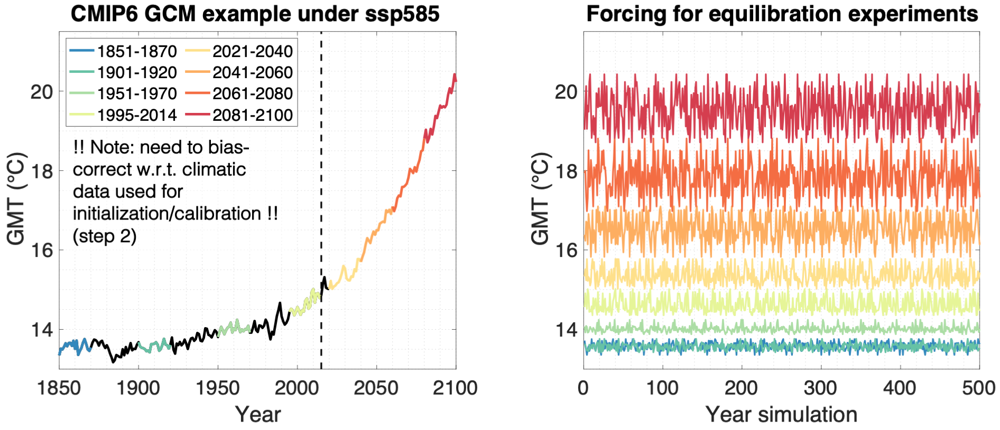
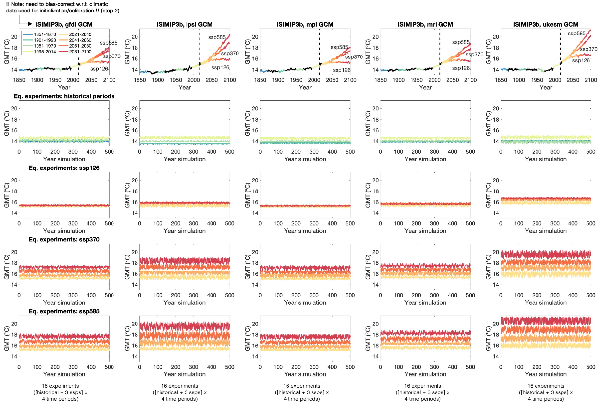

# GlacierMIP3: global glacier mass change equilibration experiments (GlacierMIP3 - Equi)

## 1. What are we planning to do, and why?

GlacierMIP3 aims to address three fundamental questions:

1. What would be the equilibrium volume and area of all glaciers outside the ice sheets if global mean temperatures were to stabilize at present-day levels?

2. What would be the equilibrium volume and area of all glaciers outside the ice sheets if global mean temperatures were to stabilize at different temperature levels (e.g. +1.5°C, +2°C, relative to pre-industrial)?

3. For each of these global mean temperature stabilization scenarios, how much time would the glaciers need to reach their new equilibrium?

These questions are IPCC relevant, but have received relatively little attention in the literature (e.g., [Marzeion et al. 2018, Nat. Clim. Change](https://doi.org/10.1038/s41558-018-0093-1)). The first question provides information about committed mass loss, while the second and third are policy-relevant since climate agreements typically target a specific maximum temperature increase and provides insight to the fundamental question of global glacier mass climate sensitivity and response time.

## 2. Experiments to be performed by all participants

In a nutshell, each participant **starts from a (modelled or observed) glacier geometry at the Randolph Glacier Inventory date**, after which different **constant climate forcing** scenarios are imposed. The imposed step-change forcings are defined by 20-yr time slices extracted from CMIP6 GCM data ([see Section 6](#section-6)). The forcing will be randomly repeated for a long time period, ensuring that the glaciers reach an equilibrium with the imposed climatic conditions. Results will allow us to relate equilibrium glacier volumes and areas to air temperature increases above pre-industrial levels.

In detail, the simulations will consist of three main steps:

- **Step 1**. Participants use their **calibrated** model, or calibrate their model to any reference meteorological forcing data they usually use (e.g. ERA, CRU) and simulate the **glacier geometry at the RGI date** (for models that do not start from an observed geometry). This first step only needs to be done once: i.e. independent of the equilibration experiment.
- **Step 2**. Participants will have to **bias-correct** the prescribed CMIP6 GCMs (as they usually do, and as done in [GlacierMIP2](https://doi.org/10.1029/2019EF001470)) prior to running the experiment. The bias correction between "past" forcing data used for model initialization/calibration (e.g. ERA, CRU) and "past from GCM" climate forcing must be done for every glacier model individually. This bias-correction, which should ensure that similar mass balances are obtained when forcing the model with "past" and "past from GCM" data, is not prescribed by GlacierMIP. Participants who intend to use their calibrated models from GlacierMIP2 only need to bias-correct the new CMIP6 GCM data, in the same way they did for [GlacierMIP2](https://doi.org/10.1029/2019EF001470).
- **Step 3**. Starting glacier geometry at the RGI date (observed or simulated, from step 1), and the bias-corrected CMIP6 GCM data (step 2), the **glacier equilibration** is simulated using the climatic forcing from the following **eight repeat-periods** : 
    `1851-1870`, `1901-1920`, `1951-1970`, `1995-2014`, `2021-2040`, `2041-2060`, `2061-2080` and `2081-2100`
  - To avoid a cyclicity in the volume/area time series, the years within the repeat reference period are **shuffled**. The order in which the calendar years are shuffled is imposed and needs to be read in from a csv-file (see [section 6](#section-6) for details)
  - The equilibration experiments will be run for a **2000/5000-yr time period** (depending on the region, see [Table 1](#table-1)). This long time period will ensure that also large and gently sloping glaciers with long response times will reach equilibrium by the end of the simulation. The participants are asked to run the simulations for the entire time period. If the participants need to reduce the length of the experiments for computational reasons, a criterion needs to be defined when to stop the simulation; however, the submitted volume/area time series need to be extrapolated to correspond to the imposed 2000/5000-yr time period.

  

**Figure 1** Illustration of climatic data from CMIP6 GCM (ISIMIP3b IPSL ssp585) and application of this data for equilibration experiments (here shown for global mean temperature, GMT). The left panel represents the actual GCM data (from 1850 to 2100), while the right panel shows the forcing for the eight distinct equilibration experiments (here shown for the first 600 yrs shuffling of reference 20-yr time-period; total series are 5000 years long). For an overview of all GCMs considered and the total 80 equilibration experiments resulting from this, refer to [Suppl. Fig. 1](#suppl-fig-1).

## 3. Standardization of experiments

- **Glacier inventory data** from RGI6.0
- **Ice thickness** : we suggest using the consensus estimate from [Farinotti et al., 2019 (Nature Geoscience)](https://doi.org/10.1038/s41561-019-0300-3), if possible (not possible for some models that evolve the volumes). Participants can also choose to use their (previously) calibrated models and do not need to update their initial ice thicknesses to the consensus estimate.
- **Greenland periphery** : all glaciers with connectivity level 0 and 1 should be included, level 2 glaciers should be excluded (as was the case for [GlacierMIP2](https://doi.org/10.1029/2019EF001470))
- Ideally, participants cover all **RGI regions** ; however, the minimum requirement for participation is the computation of at least one complete RGI region.

  
| **RGI region** | **A (km²)** | **V (10³ km³)**| **Length of experiments** |
| --- | --- | --- | --- |
| 01 Alaska | 86,677 | 18.98 | 5000 years |
| 02 Western Canada and United States | 14,629 | 1.06 | 2000 years |
| 03 Arctic Canada North | 104,920 | 28.33 | 5000 years |
| 04 Arctic Canada South | 40,860 | 8.61 | 5000 years |
| 05 Greenland Periphery | 89,651 | 15.69 | 5000 years |
| 06 Iceland | 11,052 | 3.77 | 5000 years |
| 07 Svalbard | 33,932 | 7.47 | 5000 years |
| 08 Scandinavia | 2,947 | 0.30 | 2000 years |
| 09 Russian Arctic | 51,551 | 14.64 | 5000 years |
| 10 North Asia | 2,399 | 0.14 | 2000 years |
| 11 Central Europe | 2,091 | 0.13 | 2000 years |
| 12 Caucasus and Middle East | 1,305 | 0.06 | 2000 years |
| 13 Central Asia | 49,295 | 3.27 | 2000 years |
| 14 South Asia West | 33,561 | 2.87 | 2000 years |
| 15 South Asia East | 14,734 | 0.88 | 2000 years |
| 16 Low latitudes | 2,341 | 0.10 | 2000 years |
| 17 Southern Andes | 29,368 | 5.34 | 5000 years |
| 18 New Zealand | 1,161 | 0.07 | 2000 years |
| 19 Antarctic and subantarctic | 132,771 | 46.47 | 5000 years |

**Table 1** Length of equilibration experiments for the various RGI regions. The area is from RGI v6.0, while the volume is from the consensus estimate by [Farinotti et al. (2019)](https://doi.org/10.1038/s41561-019-0300-3). For regions with a total ice volume below 3.5 x 103 km³, the equilibration experiments need to be run for 2000 years, while for regions with a volume larger than 3.5 x 103 km³, the experiments should be run for 5000 years. These time periods are long enough (conservative) based on preliminary experiments conducted with the [Open Global Glacier Model (OGGM)](https://oggm.org/), but of course other models might have different response times.

## 4. Requested output   

- **Annual time series of regional glacier volume and area** for each experiment and for each RGI region. **This needs to be provided as an individual NetCDF file per RGI region and for every equilibration experiment**. An example of how the data should be outputted is available in the [netcdf_templates][netcdf_templates] folder (`Zekollari_rgi08_sum_2061-2080_ipsl-cm6a-lr_ssp585.nc`).
- When you are ready to submit your results, contact us. We will then inform you about how the data will be collected.
- Optional: If possible, also provide the volume and area evolution at the individual glacier level. These data can be useful for a possible additional study to derive the response time of individual glaciers at the global scale, and how this relates to specific glacier characteristics. An example of how the data should be outputted is available in the [netcdf_templates][netcdf_templates] folder (`OGGM-dyn_rgi11_glaciers_1901-1920_ipsl-cm6a-lr_hist.nc`).

The file naming and format convention of the netCDF files is described in detail in the [netcdf file format notebook](netcdf_templates/netcdf_file_format.ipynb).

## 5. Requirement for participation  

All participants are required, if possible, to provide the requested output ([Section 4](#section-4)) for all prescribed experiments that the model is able to handle (as some models will not be able to simulate glacier advance). The minimum requirement for participation is the computation of at least one complete RGI region. All data providers will be authors in the envisioned publication.

## 6. GCM data and shuffling of the years  

The climatic forcing comes from the latest phase of the **[The Inter-Sectoral Impact Model Intercomparison Project: ISIMIP3b](https://www.isimip.org/gettingstarted/isimip3b-bias-correction/)**. A total of 5 bias-corrected GCMs ([Table 2](#table-2)) are available, from which data is used from the historical period (1850-2014) and the future (2015-2100: ssp126, ssp370 and ssp585). This **data is originally available at the daily resolution for a total of 11 variables** : near-surface air temperature (daily min, mean, max), precipitation, relative humidity, specific humidity, wind speed, snowfall flux, air pressure and downwelling radiation (short- and longwave).

For **ease of use**, the data has been transformed to the **monthly resolution for precipitation, temperature and the std. dev. of the daily temperature within a month** [(link to applied code)](isimip3b_postprocessing_analysis/isimip3b_postprocess_to_monthly.ipynb), and can directly be accessed here: [https://cluster.klima.uni-bremen.de/~lschuster/isimip3b/](https://cluster.klima.uni-bremen.de/~lschuster/isimip3b/) (total of ca. 80 GB). For models using monthly temperature and precipitation, we suggest directly using these processed data. Those who need other variables (than temperature and precipitation), or who need the data at another time resolution, should download the original data from the [ISIMIP repository](https://esg.pik-potsdam.de/search/isimip/) (note: very large data volume given the daily resolution).

For each of the 8 time periods considered (1851-1870, 1901-1920, 1951-1970, 1995-2014, 2021-2040, 2061-2080, 2081-2100), the order in which the calendar years are shuffled is imposed and needs to be read from the [shuffling/shuffled_years_GlacierMIP3.csv](shuffling/shuffled_years_GlacierMIP3.csv) file.

These timeseries are used by the modelling groups to generate the GCM timeseries at the glacier locations for their models. **As a check** (to make sure that all participants agree on how to generate the timeseries),  we provide two sample timeseries in  [shuffling/test_shuffling](shuffling/test_shuffling) folder for two glaciers (Hintereisferner in Austria and Glaciar Shallap in Peru). Additionally, the [python](shuffling/shuffling_workflow_python.ipynb) and [MATLAB](shuffling/shuffling_workflow_matlab.m) codes that were used to generate these test time series are provided as a template for your own data ingestion code.

  
| **ISIMIP 3b GCMs** |
| --- |
| gfdl-esm4\_r1i1p1f1 |
| psl-cm6a-lr\_r1i1p1f1 |
| mpi-esm1-2-hr\_r1i1p1f1 |
| mri-esm2-0\_r1i1p1f1 |
| ukesm1-0-ll\_r1i1p1f2 |

**Table 2** ISIMIP3b bias-corrected GCMs

## 7. Timeline  

- 01 July 2021: call for contributions
- 01 December 2021: submission deadline for results

--- 
  

**Suppl. Figure 1** Illustration of GCM forcing experiments shown here for the global mean temperature (GMT). The first row represents the actual GCM data (from 1850 to 2100), while the other rows (2-5) show the forcing for the eight distinct equilibration experiments (here shown for the first 600 yrs shuffling of reference 20-yr time-period; total series are 5000 years long) for the historical time period (row 2) and the three ssps considered (rows 3-5).
